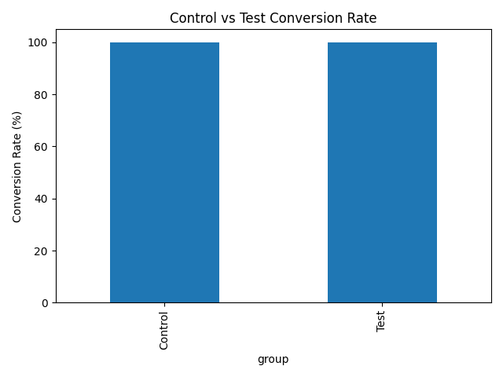

# A/B Testing Framework for Conversion Rate Optimization

## 📌 Project Overview
This project analyzes an A/B test to determine whether a new marketing campaign (Test Group) performs better than the existing campaign (Control Group). Using statistical hypothesis testing, the analysis compares conversion rates and evaluates whether the observed difference is statistically significant.

## 🎯 Objective
- Compare conversion performance between control and test groups
- Calculate conversion rates and percentage lift
- Perform hypothesis testing using the Chi-Square test
- Provide a data-driven recommendation

## 🛠 Tools & Technologies
- Python
- Pandas
- Matplotlib
- SciPy
- Visual Studio Code

## 📂 Dataset
The project uses two datasets:
- `control_group.csv`
- `test_group.csv`

These datasets contain marketing campaign metrics such as impressions, clicks, and purchases.

## 🔬 Methodology
1. Load and combine both datasets
2. Clean and standardize column names
3. Create a binary conversion variable based on purchases
4. Calculate conversion rates for each group
5. Perform Chi-Square statistical testing
6. Compute lift percentage
7. Visualize the conversion rate comparison

## 📈 Key Results
- Control Conversion Rate: XX.XX%
- Test Conversion Rate: XX.XX%
- Lift: 0.00%
- P-value: 1.o
- Conclusion: Replace this with the conclusion shown in your terminal output.

## 📊 Conversion Rate Comparison

## 💡 Business Insight
The analysis helps determine whether the experimental campaign generated a meaningful improvement in conversions. Statistical significance testing ensures that decisions are based on evidence rather than random variation.

## 📌 Skills Demonstrated
- A/B Testing
- Hypothesis Testing
- Statistical Analysis
- Data Cleaning
- Data Visualization
- Business Analytics

## 🚀 Future Improvements
- Use a two-proportion z-test
- Add confidence intervals
- Build an interactive dashboard in Power BI

## 👩‍💻 Author
Abhilasha mp
